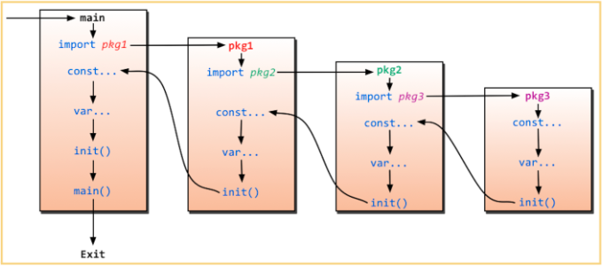

# golang学习笔记（快速入门）

个人Go语言学习demo 本项目demo 均基于

- [8小时 语雀笔记](https://www.yuque.com/aceld/mo95lb/ovib08)
- [8小时 B站视频](https://www.bilibili.com/video/BV1gf4y1r79E)
- [zinx 框架项目地址](https://gitee.com/Aceld/zinx)

以下内容均来自与对 **刘丹冰Aceld** 大佬的视频和笔记的整理

感谢 **刘丹冰Aceld** 大佬的无私奉献！

# 一、学习要求

- 非0基础 需要有其他语言开发的基础(比如 C/Java/php 等偏后端语言环境)
- 基本网络编程(TPC/IP socket 等) 和 并发思想 
- 计算机基本认知(系统 服务器 硬件 等)
- 需要有Linux基础(常用指令)

## 适合人群

已经掌握一门语言 比如Java后端 需要拓展知识栈 快速上手golang 的人群

## 大纲
- golang环境安装
- golang语言特性
- golang语法
- golang进阶
- golang实战案例

# 二、golang 开发环境安装

刘大佬是Linux+vscode 需要Linux开发环境的可以看刘大佬的视频

视频：[开发环境重点和IDE选型推荐 P2](https://www.bilibili.com/video/BV1gf4y1r79E/?p=2)

因为我日常开发环境都是windows只有部署项目时会部署的linux，所以我的环境是windows。

VSCode和GoLand都有用，不过对我来说我只是吧VSCode当文本编辑器来用，并不熟悉，日常开发AndroidStudio和IDE用的比较多，GoLand操作起来更顺手，所以选用GoLand。

Goland破解请自行百度，有能力的富哥可以支持正版。

## Go下载

[golang 镜像站 下载地址](https://golang.google.cn/dl/)


下载完成后 疯狂 **下一步** 即可

## 配置环境

打开环境变量 配置GoPath 和 GoFile

## 验证

打开cmd 输入查看安装的版本

```shell
go version
```

如果出现提示

```shell
go version go1.20.4 windows/amd64
```

可以看到我这里安装的是 1.20.4的版本 说明安装并且配置没问题

然后安装GoLand

## GoLand下载

[GoLand官网下载地址](https://www.jetbrains.com/go/)


# 三、golang语言特性

## 1、Golang的优势

### 1) 极简的部署方式
- 可直接编译成机器码
- 不依赖其他库
- 直接运行即可部署

编译演示

进入某个项目的目录
```shell
go build main.go
```
编译成功会生成一个 main 可执行文件

查看这个main用了哪些依赖库
```shell
ldd main
```
可以看到它只包含标准的 so库 libc库 和 pthread库 不依赖其他任何库

可使用 ./ 命令 直接执行
```shell
./ main
```

以上演示为Linux环境

windows环境下编译同理

```shell
go build main.go
```

在windows下编译成功后会生成 **main.exe** 可执行程序

我们双击运行即可 或者 在cmd里运行也行 

**一般我们开发调试在IDE里操作即可 不用专门使用命令行编译 这里只是演示过程**

### 2) 静态类型语言

静态语言(Java, C, Go 等)的优势：可以在编译时检查出隐藏的问题(比如哪一行语法错误 或者少写了个符号等) 和静态语言对立的是动态语言(如shell脚本, python脚本, js等)，动态语言没有编译器 所以只能在程序运行过程中逐条判断

### 3) 语言层面的并发

- 天生支持并发 非包装类型的优化
- 充分的利用多核 尽量提高CPU的利用率

### 4) 强大的标准库

- runtime 系统调度机制
- 高效的GC垃圾回收
- 丰富的标准库 (文本操作 输入/输出 时间/日期 json/xml socket/rpc 线程/锁 文件系统 并发 邮件 加解密 等覆盖了日常开发绝大部分场景)

### 5） 简单易学

- 仅有 25 个关键字
- C语言语法简洁 内嵌C语法支持
- 面向对象特征(继承 封装 多态)
- 跨平台语言 类似于java 只要装了go环境 都可以运行

### 6) 大厂领军

国内外各种大厂都在用 也有很多开源框架 给你用

## 2、Golang适合做什么(强项)

### 1) 云计算基础设施领域

docker, kubernetes, etcd, consul, cloudflare CDN, 七牛云 等

### 2) 基础后端软件

tidb, influxdb, cockroachdb 等

### 3) 微服务

go-kit, micro, monzo/typhon, bilibili 等

### 4) 互联网基础设施

以太坊, hyperledger 等

## 3、Golang大作

- Docker (16年docker火了 让go成了16年 年度语言)
- kubernetes

## 4、Golang的不足

### 1) 包管理

我们所使用大部分第三方库 都是托管在github上的

### 2) 无泛型 (目前已经支持)

早期go不支持泛型 不过在1.18已经支持了 

### 3) Error

所有的 **Exception** 都用 **Error** 来处理(比较有争议)

没有java的 try-catch 捕获异常的操作 只能 error 一层一层抛出

### 4) 对C的降级处理

并非无缝，没有C降级到asm那么完美(序列化问题)

兼容c 不是完全兼容 可以导入 c的包 调用c的函数

# 语法

## 1、hello world

```go
package main

import "fmt"

func main() {
    fmt.Println("Hello Go")
}
```

执行

```shell
go run main.go
```

## 2、变量

获取变量类型 大写T
```go
fmt.Printt("指定类型 %T", v)
```

### 1) 先声明 再赋值

```go
//先声明
var str string
var i int
//再赋值
str = "ddd"
i = 188
fmt.Print("我是 str: ", str,"我是 i: ",i)
```

### 2) 自动判断类型
```go
var b = false
var i2 = 99
fmt.Print("我是 b: ", b, "我是 i2: ", i2)
```

### 3) 省略var 直接 :=

直接 := 的形式 不适用于 全局变量的声明 只能在函数中使用。

```go
dev := "Go Developers"
fmt.Println("Go Hello World! ", dev)
```

### 4) 多变量声明

```go
//同时声明两个变量 x 和 y
var x, y int
//赋值
x = 10
y = 99
fmt.Print("坐标", x, ", ", y)


//这种分解的写法,一般用于声明全局变量
var (
    top1 int
    topb bool
)
top1 = 10
topb = true
fmt.Print("全局变量", top1,topb)


//同时声明并赋值 指定类型
var p1, p2, p3 int = 1, 2, 3
fmt.Print("指定类型 ", p1, p2, p3)


//同时声明并赋值 不指定类型
var pi, pb, ps = 1, false, "dd"
fmt.Print("不指定类型 ", pi, pb, ps)

//不带声明格式的只能在函数体内实现 无法定义为全局变量
g, h := 123, "ddd"
fmt.Println(g, h)


//实际上7的赋值被废弃，变量 _  不具备读特性
_, value := 7, 5
//fmt.Println(_) //_变量的是读不出来的
fmt.Println(value) //5
```

## 3、常量

### 常量的定义

常量是一个简单值的标识符，在程序运行时，不会被修改的量

常量中的数据类型只可以是布尔型、数字型（整数型、浮点型和复数）和字符串型。

```go
//隐式类型定义
const bookTitle = "百科全书"
//显式类型定义
const price float32 = 6.66
fmt.Println(bookTitle, "的价格是", price)
```

常量可以用len(), cap(), unsafe.Sizeof()常量计算表达式的值。

常量表达式中，函数必须是内置函数，否则编译不过：

```go
const (
    a = "abc"
    b = len(a)
    c = unsafe.Sizeof(a)
)
println(a, b, c)// abc,3,16
```
字符串类型在 go 里是个结构 包含指向底层数组的指针和长度 

这两部分每部分都是 8 个字节 所以字符串类型大小为 16 个字节

### 枚举

常量还可以用作枚举

```go
const (
    GIRL = 0
    BOY  = 1
)
fmt.Println(BOY, GIRL)
```

#### iota

可以理解为自增常量

```go

const (
    l0 = iota //0
    l1 //1
    l2 //2
    l3 //3
)
```
iota 默认值是0 后面的 i1, i2, i3 不用赋值 系统会自动 +1

iota 只能在const里用 不能和var使用

## 4、函数

### 单返回值函数

该函数 包含2个形参 x和y 有1个返回值
```go
func plus(x int, y int) int {
    return x + y
}
```

### 多返回值函数

该函数 包含2个形参 x和y 有2个返回值

```go
func swap(x, y string) (string, string) {
    return y, x
}
```

### 有名称的返回值函数

```go
func replace(x, y string) (r1 string, r2 string) {
    r1 = x
    r2 = y
    return 
}
//相同返回值类型可以省略
func replace(x, y string) (r1, r2 string) {
    r1 = x
    r2 = y
    return
}
```

### init 函数

init 函数 每个 package 都可以声明

用于初始化数据 和 配置文件

### main 函数

main 函数 只能在 main package 中声明

程序主入口 只能有一个main

### 执行顺序

程序的初始化和执行都起始于main包

先执行所有包的 init 函数，再执行 main 函数。

这里放一张大佬的图



### public 和 private

函数名 大写开头 就是 public 只要导入package 就能调用，

小写开头就是 private 只能在自己的 package 中调用。 

### import 的 匿名 和 别名

#### 匿名
```go
import _ "package1"
```
会执行 这个package 的 init 函数

但是无法调用 该package 里的 其他函数。

#### 别名

```go
import pkg "package1"
```

给包起别名 可以通过别名 . 出方法

```go
pkg.fun()
```

### 函数参数传递

#### 值传递

值拷贝 开辟新的内存地址

```go
// 修改值
func change(p int) {
    p = 50
}

// 验证
func test() {
    i = 100 //定义一个变量i值为100
    change(i) //值传递
    fmt.Println("修改后: ", i)//100
}
```
最后输出是 100

因为当前是 值传递 外边的i 和 里面的p 是不同的内存地址。

里边的p 再怎么修改 不影响外边i的值

#### 引用(指针)传递

```go
// 修改值
func change(p *int) {
    *p = 50
}

// 验证
func test() {
    i = 100    //定义一个变量i值为100
    change(&i) //传递i的内存地址
    fmt.Println("修改后: ", i)//50
}
```

可以看到 输出了50

因为 p是一个int类型的指针 它指向了 i 的内存地址
所以 i 和 p 使用的是同一个内存地址
修改了 p 就 等于 修改了 i

## 4、defer


